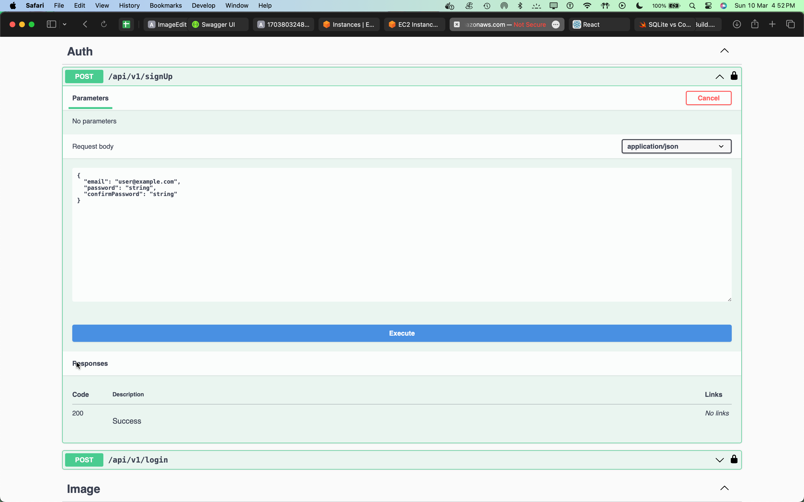
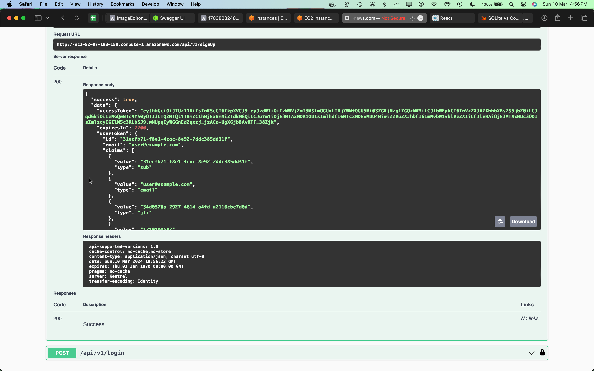
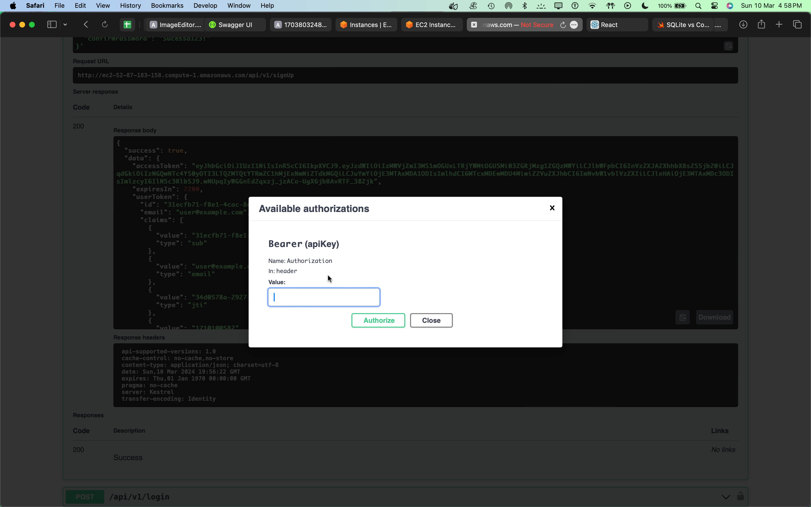
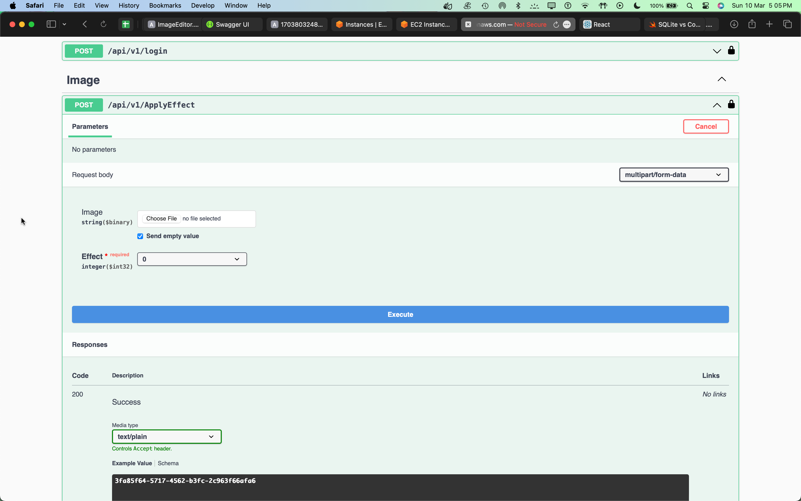
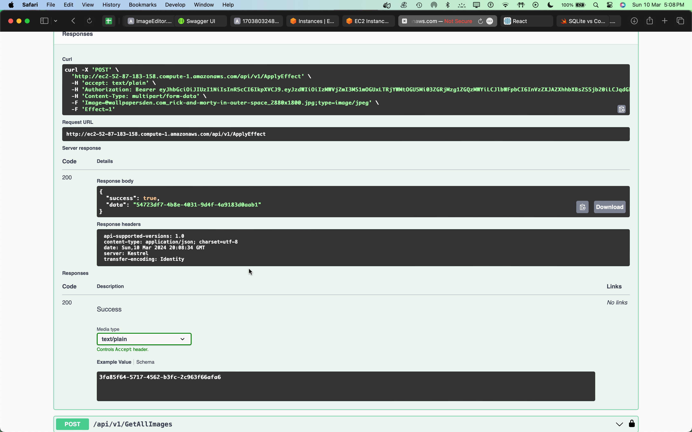
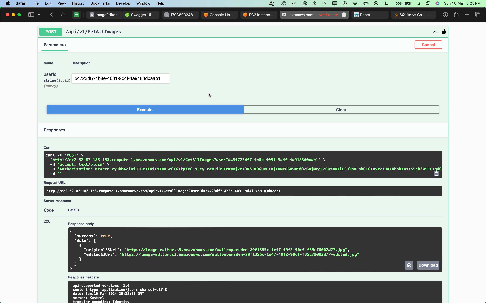

# Project ImageEditor APIs

This tool has been released to facilitate our user life where they can apply some simple effects on their pictures.

## Features
- Receive a image and the user select which effect they want to apply in it, them in milliseconds they have the result.

## Using the App
- First Signup for using the API you can make a request on POST /api/v1/SignUp
  - Swagger Doc
   
- Copy the Token which the Controller will provide you, click on the lock icon and write Bearer YOUR_TOKEN
  - Response Img:
  
  - Field to write down the token:
  
- The POST /api/v1/ApplyEffect endpoint is where you can request to the app apply an effect in your image
  - Which are:
    - Blur - 1;
    - Gray - 2;
    - Sepia - 3;
    - Vignette - 4;
  - I've choose receiving form-data to facilitate usage in front-end so our front can use a simply input of the type file
  
- After uploading the image and everything did go well the response od this controller will be your id in our Database
  
- To retrieve all the images you uploaded into the app you make a request on GET /api/v1/GetAllImages?userId={GUID}
  
- PS.: I've choose saving all the image original and edited in a S3 Bucket, I gave access to public so everyone can retrieve data from data bucket, also I save data in a Amazon RDS Postgres.
